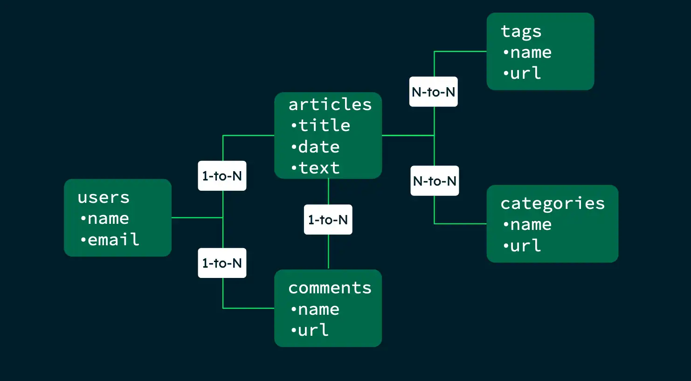

# Лекція 2: Моделювання даних

## Представлення (Views)

Представлення MongoDB — це об'єкт лише для читання, до якого можна робити запити, вміст якого визначається **конвеєром агрегації** в інших колекціях або представленнях.
MongoDB не зберігає вміст представлення на диску. Вміст представлення обчислюється на вимогу, коли клієнт запитує представлення.

MongoDB пропонує два різних типи представлень: стандартні представлення та матеріалізовані представлення на вимогу. Обидва типи представлень повертають результати з конвеєра агрегації.
* Стандартні представлення обчислюються під час зчитування представлення та не зберігаються на диску. 
* Матеріалізовані представлення на вимогу зберігаються на диску та зчитуються з нього. Вони використовують етап **$merge** або **$out** для оновлення збережених даних.

Поки що розглянемо тільки стандартні представлення.

**db.createCollection()** синтаксис:
```javascript
db.createCollection(
  "<viewName>",
  {
    "viewOn" : "<source>",
    "pipeline" : [<pipeline>],
    "collation" : { <collation> }
  }
)
```

**db.createView()** синтаксис:
```javascript
db.createView(
  "<viewName>",
  "<source>",
  [<pipeline>],
  {
    "collation" : { <collation> }
  }
)
```

Додатковий параметр **collation** визначає порядок сортування.

### Приклад

Заповнення колекції:

```javascript
db.students.insertMany( [
   { sID: 22001, name: "Alex", year: 1, score: 4.0 },
   { sID: 21001, name: "bernie", year: 2, score: 3.7 },
   { sID: 20010, name: "Chris", year: 3, score: 2.5 },
   { sID: 22021, name: "Drew", year: 1, score: 3.2 },
   { sID: 17301, name: "harley", year: 6, score: 3.1 },
   { sID: 21022, name: "Farmer", year: 1, score: 2.2 },
   { sID: 20020, name: "george", year: 3, score: 2.8 },
   { sID: 18020, name: "Harley", year: 5, score: 2.8 },
] ) 
```

Створення представлення

```javascript
db.createView(
   "firstYears",
   "students",
   [ { $match: { year: 1 } } ]
)
```

Запит представлення

```javascript
db.firstYears.find({}, { _id: 0 } )
```

Вихідні дані містять лише документи з даними про студентів першого курсу

```javascript
[
  { sID: 22001, name: 'Alex', year: 1, score: 4 },
  { sID: 22021, name: 'Drew', year: 1, score: 3.2 },
  { sID: 21022, name: 'Farmer', year: 1, score: 2.2 }
]
```


### Використання представлення для об'єднання двох колекцій

Створення двох колекцій

```javascript
db.inventory.insertMany( [
   { prodId: 100, price: 20, quantity: 125 },
   { prodId: 101, price: 10, quantity: 234 },
   { prodId: 102, price: 15, quantity: 432 },
   { prodId: 103, price: 17, quantity: 320 }
] )
db.orders.insertMany( [
   { orderId: 201, custid: 301, prodId: 100, numPurchased: 20 },
   { orderId: 202, custid: 302, prodId: 101, numPurchased: 10 },
   { orderId: 203, custid: 303, prodId: 102, numPurchased: 5 },
   { orderId: 204, custid: 303, prodId: 103, numPurchased: 15 },
   { orderId: 205, custid: 303, prodId: 103, numPurchased: 20 },
   { orderId: 206, custid: 302, prodId: 102, numPurchased: 1 },
   { orderId: 207, custid: 302, prodId: 101, numPurchased: 5 },
   { orderId: 208, custid: 301, prodId: 100, numPurchased: 10 },
   { orderId: 209, custid: 303, prodId: 103, numPurchased: 30 }
] )
```

Створення об'єднаного представлення (Joined View)

```javascript
db.createView( "sales", "orders", [
   {
      $lookup:
         {
            from: "inventory",
            localField: "prodId",
            foreignField: "prodId",
            as: "inventoryDocs"
         }
   },
   {
      $project:
         {
           _id: 0,
           prodId: 1,
           orderId: 1,
           numPurchased: 1,
           price: "$inventoryDocs.price"
         }
   },
      { $unwind: "$price" }
] )
```

* Етап **$lookup** використовує поле **prodId** у колекції замовлень для "об'єднання" документів.
* Відповідні документи додаються як масив у поле **inventoryDocs**.
* Етап **$project** вибирає підмножину доступних полів.
* Етап **$unwind** перетворює поле ціни з масиву на скалярне значення.

Документи у представленні **sales**
```javascript
{ orderId: 201, prodId: 100, numPurchased: 20, price: 20 },
{ orderId: 202, prodId: 101, numPurchased: 10, price: 10 },
{ orderId: 203, prodId: 102, numPurchased: 5, price: 15 },
{ orderId: 204, prodId: 103, numPurchased: 15, price: 17 },
{ orderId: 205, prodId: 103, numPurchased: 20, price: 17 },
{ orderId: 206, prodId: 102, numPurchased: 1, price: 15 },
{ orderId: 207, prodId: 101, numPurchased: 5, price: 10 },
{ orderId: 208, prodId: 100, numPurchased: 10, price: 20 },
{ orderId: 209, prodId: 103, numPurchased: 30, price: 17 }
```


### Створення представлення зі стандартним сортуванням (View with Default Collation)

Collation дозволяє вказати специфічні для мови правила порівняння рядків, такі як правила для регістру літер та знаків наголосу.

Створення колекції

```javascript
db.places.insertMany([
   { _id: 1, category: "café" },
   { _id: 2, category: "cafe" },
   { _id: 3, category: "cafE" }
])
```

Наступна операція створює представлення, вказуючи сортування на рівні представлення

```javascript
db.createView(
   "placesView",
   "places",
   [ { $project: { category: 1 } } ],
   { collation: { locale: "fr", strength: 1 } }
)
```
Наступна операція використовує сортування представлення:

```javascript
db.placesView.countDocuments( { category: "cafe" } )
```

Операція повертає **3**.

### Зміна або видалення представлення

Щоб видалити представлення, скористайтеся методом ** db.collection.drop() ** для представлення.
Щоб змінити представлення, ви можете: 
* Видалити та створити представлення заново. 
* Використати команду collMod.

Приклад

Розглянемо наступне представлення з назвою **lowStock**:

```javascript
db.createView(
   "lowStock",
   "products",
   [ { $match: { quantity: { $lte: 20 } } } ]
)
```

```javascript
db.runCommand( {
   collMod: "lowStock",
   viewOn: "products",
   "pipeline": [ { $match: { quantity: { $lte: 10 } } } ]
} )
```

## Обмежені колекції (Capped Collections)

Обмежені колекції – це колекції фіксованого розміру, які додають та отримують документи на основі порядку вставки. Обмежені колекції працюють подібно до циклічних буферів: як тільки колекція заповнює виділений простір, вона звільняє місце для нових документів, перезаписуючи найстаріші документи в колекції.

Приклад команди

```javascript
db.createCollection( "log", { capped: true, size: 100000 } )
```

### Кластерні колекції (Clustered Collections)

Кластерні колекції (починаючи з 5.3) зберігають індексовані документи в тому ж файлі WiredTiger (storage engine), що й специфікація індексу. Зберігання документів колекції та індексу в одному файлі забезпечує переваги для зберігання та продуктивності порівняно зі звичайними індексами.

Кластерні колекції створюються за допомогою кластерного індексу. Кластерний індекс визначає порядок, у якому зберігаються документи.

Приклад 

```javascript
db.createCollection(
   "stocks",
   { clusteredIndex: { "key": { _id: 1 }, "unique": true, "name": "stocks clustered key" } }
)
```

* **"key": { _id: 1 }**, який встановлює ключ кластерного індексу в поле **_id**.
* **"unique": true**, що вказує на те, що значення ключа кластерного індексу має бути унікальним.
* **"name": "stocks clustered key"**, який встановлює ім'я кластерного індексу.

## Моделювання даних (Data Modeling)
Моделювання даних стосується організації даних у базі даних та зв'язків між пов'язаними сутностями. Дані в MongoDB мають гнучку модель схеми, що означає:
* Документи в колекції не обов'язково повинні мати однаковий набір полів.
* Тип даних поля може відрізнятися між документами в колекції.

Гнучка модель даних дозволяє вам упорядковувати дані відповідно до потреб вашої програми. MongoDB — це база даних документів, тобто ви можете вбудовувати пов’язані дані в поля об’єктів.

Гнучка схема корисна в таких сценаріях:
* Ваша компанія відстежує, в якому відділі працює кожен співробітник. Ви можете вбудувати інформацію про відділ у колекцію співробітників, щоб повертати відповідну інформацію в одному запиті.
* Ваш додаток e-commerce показує п'ять останніх відгуків під час відображення товару. Ви можете зберігати останні відгуки в тій самій колекції, що й дані про продукт, а старіші відгуки — в окремій колекції, оскільки до них не так часто звертаються.
* Вашому магазину одягу потрібно створити односторінковий додаток для каталогу товарів. Різні товари мають різні атрибути, а отже, використовують різні поля документа. Однак ви можете зберігати всі товари в одній колекції.

Проектування схеми: відмінності між реляційними та документними базами даних

| Поведінка реляційної бази даних | Поведінка документо-орієнтованих баз даних |
|---------------------------------|-------|
| Перш ніж додавати дані, потрібно визначити схему таблиці. | Ваша схема може змінюватися з часом, відповідно до потреб вашої програми. |
|Часто потрібно об'єднати дані з кількох різних таблиць, щоб повернути дані, необхідні вашій програмі.|Гнучка модель даних дозволяє зберігати дані відповідно до способу, яким їх повертає ваша програма, та уникати об'єднань (join). Уникнення об'єднань між кількома колекціями підвищує продуктивність та зменшує навантаження.|

### **Планування схеми**

**1. Визначте робоче навантаження вашої програми.**

**2. Відображайте зв'язки між об'єктами у ваших колекціях.**

**3. Застосовуйте шаблони проектування.**

Щоб пов’язати дані, ви можете виконати одну з наведених нижче дій:
* Вбудовуйте дані в один документ.
* Зберігайте дані в окремій колекції та отримуйте до них доступ за посиланням.

### Дублювання та узгодженість даних
Під час вбудовування пов'язаних даних в один документ ви можете дублювати дані між двома колекціями. Дублювання даних дозволяє вашій програмі запитувати пов'язану інформацію про кілька сутностей в одному запиті, логічно розділяючи сутності у вашій моделі.
Наприклад, колекція **products** зберігає п'ять найновіших відгуків у документі продукту. Ці відгуки також зберігаються в колекції **reviews**, яка містить усі відгуки про продукти. Під час написання нового відгуку відбуваються такі записи:
* Відгук додається до колекції відгуків.
* Потрібно оновити масив останніх відгуків у колекції **products**

Якщо дубліковані дані оновлюються нечасто, то для забезпечення узгодженості двох колекцій потрібна мінімальна додаткова робота. Однак, якщо дубліковані дані оновлюються часто, використання посилання для зв'язку пов'язаних даних може бути кращим підходом.

Перш ніж дублювати дані, врахуйте такі фактори:
* Як часто потрібно оновлювати дубліковані дані.
* Перевага в продуктивності для зчитування при дублюванні даних.

### Атомарність єдиного документа

У MongoDB операція запису є атомарною на рівні одного документа, навіть якщо операція змінює кілька вбудованих документів в одному документі. Це означає, що якщо операція оновлення впливає на кілька піддокументів, то або всі ці піддокументи оновлюються, або операція повністю завершується невдачею, і оновлення не відбуваються.

Денормалізована модель даних із вбудованими даними об'єднує всі пов'язані дані в одному документі, замість нормалізації в кількох документах та колекціях. Ця модель даних дозволяє атомарні операції, на відміну від нормалізованої моделі, де операції впливають на кілька документів. 

Планування та проектування схеми найкраще виконувати на ранніх етапах розробки застосунку. Початок роботи з належними методами моделювання даних допомагає запобігти проблемам зі схемою та продуктивністю в міру зростання застосунку. Коли ви дотримуєтеся практик проектування схеми на ранній стадії та належним чином, ви можете досягти кращої продуктивності та полегшити масштабування вашої програми в майбутньому.

Ви можете ітеративно розробляти свою схему та змінювати її відповідно до змін потреб вашої програми. MongoDB надає способи легкої зміни схеми без простоїв.

Залежно від вашої програми та важливості оптимізації, ви можете створити просту схему, яка охоплюватиме базову функціональність, перш ніж витрачати час на оптимізацію.

Першим кроком у процесі проектування схеми є визначення операцій, які ваш застосунок виконує найчастіше. Знання найпоширеніших запитів вашої програми допомагає мінімізувати кількість звернень програми до бази даних.

Щоб визначити дані, необхідні вашій програмі, врахуйте такі фактори:

* Користувачі вашої програми та інформація, яка їм потрібна.
* Домен вашої компанії (бізнесу).
* Журнали програм і часто виконувані запити.

У наступному прикладі показано таблицю робочого навантаження для блог-застосунку:

|Дія| Тип| Інформація| Частота| Пріоритет|
|---|----|-----------|--------|----------|
|Надіслати нову статтю| Записування| автор, текст| 10 на день| Високий|
|Надіслати коментар до статті| Записування | користувач, текст | 1000 на день (100 на статтю) | Середній|
|Переглянути статтю| Зчитування | ідентифікатор статті, текст, коментарі | 1 000 000 на день | Високий |
|Переглянути аналітику статті| Зчитування|ідентифікатор статті, коментарі, кліки| 10 на годину| Низький


Після визначення робочого навантаження вашої програми наступним кроком у процесі проектування схеми є зіставлення пов'язаних даних у вашій схемі:

* Визначте пов'язані дані у вашій схемі.
* Створіть схему для пов’язаних даних Ваша схема має відображати пов’язані поля даних та тип зв’язку між цими полями (один до одного, один до багатьох, багато до багатьох). Ваша схема може нагадувати модель «сутність-зв'язок».
* Виберіть, чи вбудовувати пов’язані дані, чи використовувати посилання. Рішення щодо вбудовування даних чи використання посилань залежить від поширених запитів вашої програми.


Наприклад схема для блог-застосунку:



```javascript
db.articles.insertOne(
   {
      title: "My Favorite Vacation",
      date: ISODate("2023-06-02"),
      text: "We spent seven days in Italy...",
      tags: [
         {
            name: "travel",
            url: "<blog-site>/tags/travel"
         },
         {
            name: "adventure",
            url: "<blog-site>/tags/adventure"
         }
      ],
      comments: [
         {
            name: "pedro123",
            text: "Great article!"
         }
      ],
      author: {
         name: "alice123",
         email: "alice@mycompany.com",
         avatar: "photo1.jpg"
      }
   }
)
```

Якщо ваша програма повертає інформацію про статтю та інформацію про автора окремо:

```javascript
db.articles.insertOne(
   {
      title: "My Favorite Vacation",
      date: ISODate("2023-06-02"),
      text: "We spent seven days in Italy...",
      authorId: 987,
      tags: [
         {
            name: "travel",
            url: "<blog-site>/tags/travel"
         },
         {
            name: "adventure",
            url: "<blog-site>/tags/adventure"
         }
      ],
      comments: [
         {
            name: "pedro345",
            text: "Great article!"
         }
      ]
   }
)
```

```javascript
db.authors.insertOne(
   {
      _id: 987,
      name: "alice123",
      email: "alice@mycompany.com",
      avatar: "photo1.jpg"
   }
)
```

Моделювання зв'язків "один до одного" за допомогою вбудованих документів


```javascript
{
   _id: "joe",
   name: "Joe Bookreader",
   address: { // вбудований документ
              street: "123 Fake Street",
              city: "Faketon",
              state: "MA",
              zip: "12345"
            }
}
```

Моделювання зв'язків «один до багатьох» за допомогою вбудованих документів


```javascript
{
   _id: "joe",
   name: "Joe Bookreader",
   address: { // вбудований документ
              street: "123 Fake Street",
              city: "Faketon",
              state: "MA",
              zip: "12345"
            }
}
```

Моделювання зв'язків «один до багатьох» за допомогою вбудованих документів

```javascript
{
   // patron and address
   _id: "joe",
   name: "Joe Bookreader",
   addresses: [ // вбудовані документи
      {
         street: "123 Fake Street",
         city: "Faketon",
         state: "MA",
         zip: "12345"
      },
      {
         street: "1 Some Other Street",
         city: "Boston",
         state: "MA",
         zip: "12345"
      }
   ]
 }
 ```


 Моделювання зв'язків «один до багатьох» за допомогою посилань на документи. Наступний приклад, буде відображати зв'язки між видавцем і книгою. Якщо кількість книг на одного видавця невелика з обмеженим зростанням, іноді може бути корисним зберігати посилання на книгу в документі видавця. В іншому випадку, якщо кількість книг на одного видавця необмежена, ця модель даних призведе до змінних, зростаючих масивів. Щоб уникнути змінних, зростаючих масивів, зберігайте посилання на видавця всередині документа книги:


 ```javascript
{
   _id: "oreilly",
   name: "O'Reilly Media",
   founded: 1980,
   location: "CA"
}
{
   _id: 123456789,
   title: "MongoDB: The Definitive Guide",
   author: [ "Kristina Chodorow", "Mike Dirolf" ],
   published_date: ISODate("2010-09-24"),
   pages: 216,
   language: "English",
   publisher_id: "oreilly"
}
{
   _id: 234567890,
   title: "50 Tips and Tricks for MongoDB Developer",
   author: "Kristina Chodorow",
   published_date: ISODate("2011-05-06"),
   pages: 68,
   language: "English",
   publisher_id: "oreilly"
}
 ```

Моделювання зв'язків «багато до багатьох» за допомогою вбудованих документів. Наведена нижче схема-приклад містить інформацію про першу та другу книги та їхніх авторів.

 ```javascript
 {
   _id: "book001",
   title: "Cell Biology",
   authors: [
     {
        author_id: "author124",
        name: "Ellie Smith"
     },
     {
        author_id: "author381",
        name: "John Palmer"
     }
   ]
}
{
   _id: "book002",
   title: "Organic Chemistry",
   authors: [
     {
        author_id: "author290",
        name: "Jane James"
     },
     {
        author_id: "author381",
        name: "John Palmer"
     }
   ]
}
 ```

